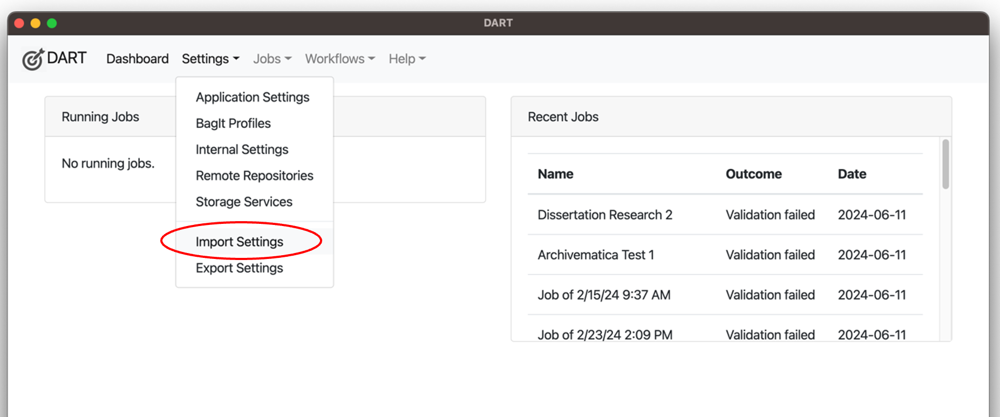
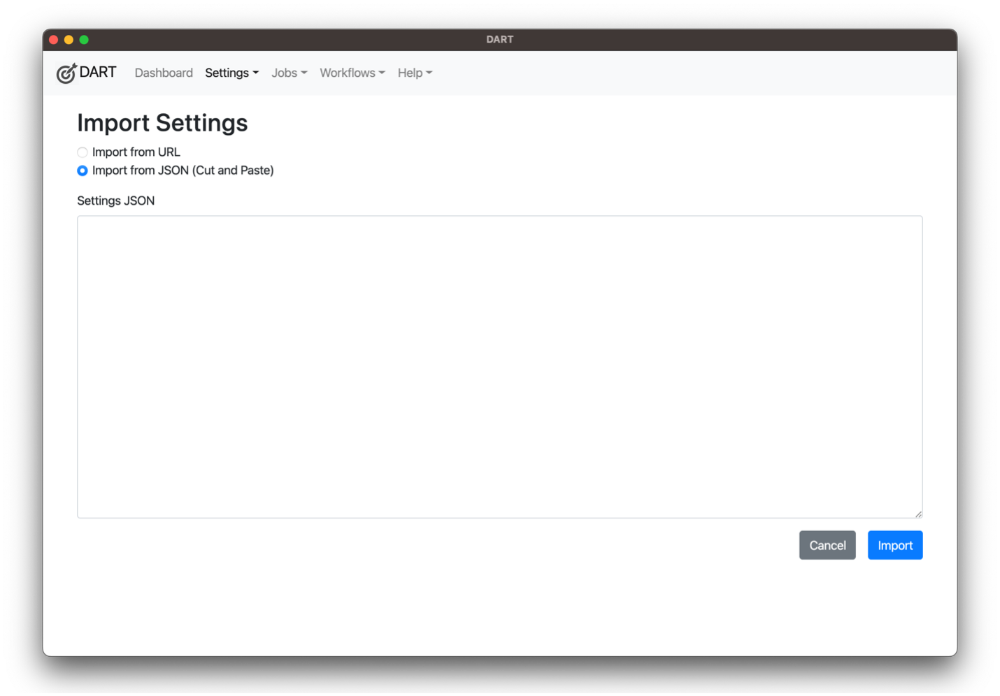
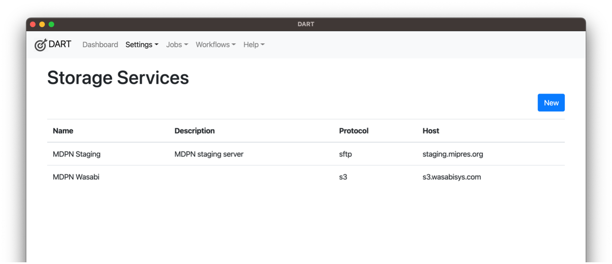
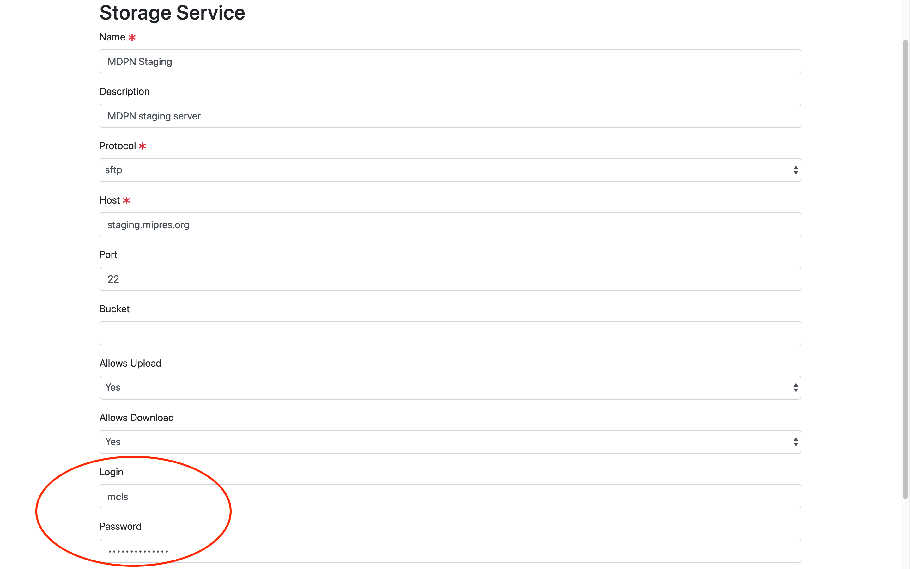

DART (Digital Archivists Resource Tool) is a GUI (Graphical User Interface) tool, developed and maintained by [AP Trust](https://aptrust.org), for packaging digital files according to the Library of Congress's [BagIt Specification](https://datatracker.ietf.org/doc/html/rfc8493) and uploading them to remote repositories. This is the tool MDPN recommends for transferring files from your institution on to the MDPN Staging Server. 

To download the current version  of DART (DART 2), visit the DART Documentation Home at [https://aptrust.github.io/dart-docs/](https://aptrust.github.io/dart-docs/). DART 2 is available for Mac, Windows, and Linux users.

Once you have download DART, you’ll need to configure it with MDPN settings. You’ll find a JSON file with the config settings in the MDPN Github at [https://github.com/MiDPN/MDPN-Config](https://github.com/MiDPN/MDPN-Config).

Once you open DART, navigate to “Settings” in the top menu and choose “Import Settings.” 

Select “Import from JSON (Cut and Paste),” paste the JSON from the MDPN Github in the box provided, and select “Import.”

This will define certain bagging/packaging parameters in DART, as well as configure the MDPN Staging Server as your Storage Service. You can confirm that the configuration was successful by making sure “MDPN Staging” shows up under “Storage Services,” which can be found under the “Settings” menu at the top.

You may add more than one Storage Service to DART, so if you would like to also add any internal storage service, you may do so without impacting the “MDPN Staging” Storage Service. 

Once you’ve successfully configured DART, you'll need to share the IP address/ranges for the workstations on which you'll be using DART to package your digital collections for deposit to the MDPN. You can find your IP by navigating to [https://whatismyip.com](https://whatismyip.com). You can submit your IP information via the [MCLS IP Reporting Form](https://www.mcls.org/mel/ip-reporting-form/). Fill in the required "Contact Information" fields and share your IP address or ranges in the box labeled "ADD these IPs." Under the "Affects access to one or more of these services" field, select, "MDPN." 

Once we receive your IP address, MDPN staff will add your IP to the allowed addresses list on the staging server and will follow up with you via email with your unique login crednetials for DART. When you receive your organization's credentials, you'll need update these in DART by naviagting to "Settings" in the menu located at the top of the application window, and then "Storage Services." Select "MDPN Staging," and enter your credentials in the "Login" and "Password" fields. 

Click the blue "SAVE" button at the bottom of the screen when you're done. Because email is not a secure way to share passwords, you'll need to change your password again before you can use DART. The [Resetting DART Login](https://midpn.github.io/public-documentation/password-reset.html) section of this documentation portal will walk you through that process.
