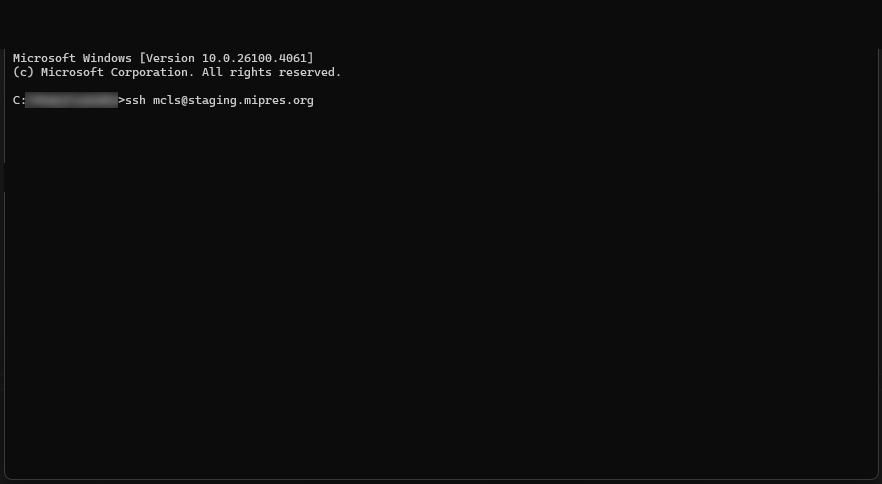
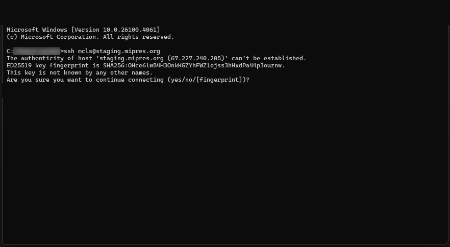
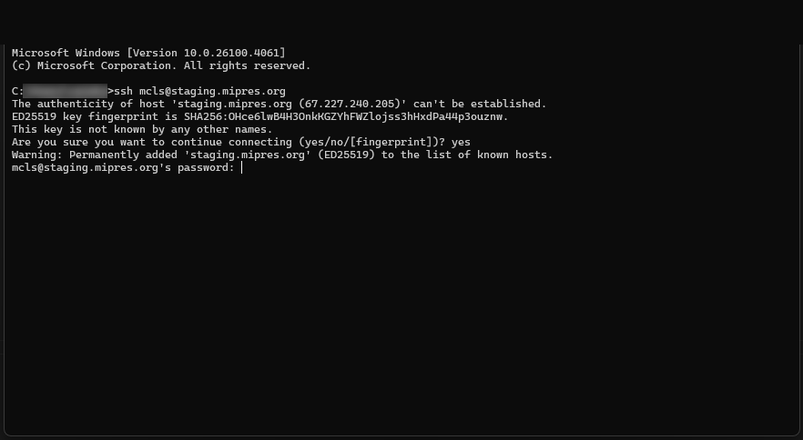

## Resetting your staging server credentials
Once provided with your login credentials to the MDPN staging server, you will need to change your password.  Using a terminal/shell program (Command Prompt in Windows, Terminal in Mac, Shell in Linux), you will need to SSH into the server using the credentials provided:
1. **ssh USERNAME@staging.mipres.org**

2. You may then see a prompt beginning with the following: *The authenticity of host 'staging.mipres.org (67.227.240.205)' can't be established.*

3. Type **yes** and hit Enter.

4. Type the password provided.

The system should then walk you through changing your password.  Once that is done, you can use your new password to deposit your content via the DART application.