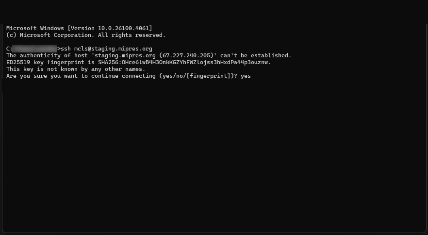

## Resetting your staging server credentials
Once provided with your login credentials to the MDPN staging server, you will need to change your password before you use DART for the first time.  Using a terminal/shell program (Command Prompt in Windows, Terminal in Mac, Shell in Linux), you will need to connect to the server via SSH using the credentials provided:
1. **ssh USERNAME@staging.mipres.org**

2. You may then see a prompt beginning with the following: *The authenticity of host 'staging.mipres.org (67.227.240.205)' can't be established.*

3. Type **yes** and hit Enter.

4. Type the password provided.

**NOTE:** when typing in your password, you will not see any visual indication on the screen that you are typing.

5.	Once logged in, the system should then walk you through changing your password.  

Once that is done, update your credentials in DART under “Settings” > “Storage Services.” You can then use your new password to deposit your content via the DART application. 

Reach out to us either directly or via [mdpnsupport@mcls.org](mailto:mdpnsupport@mcls.org) if you have any questions or concerns.
