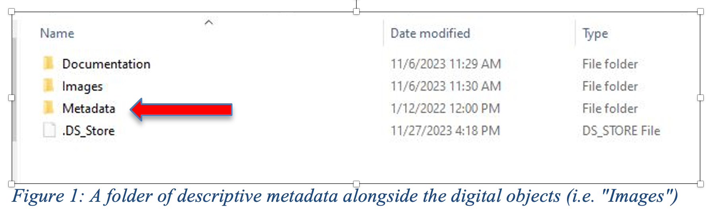
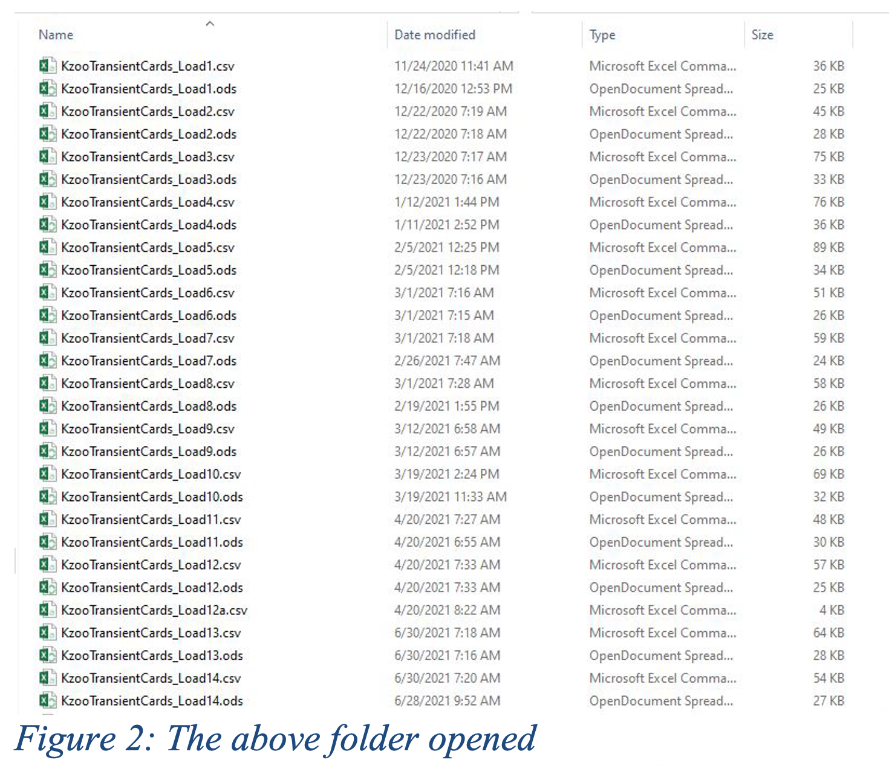
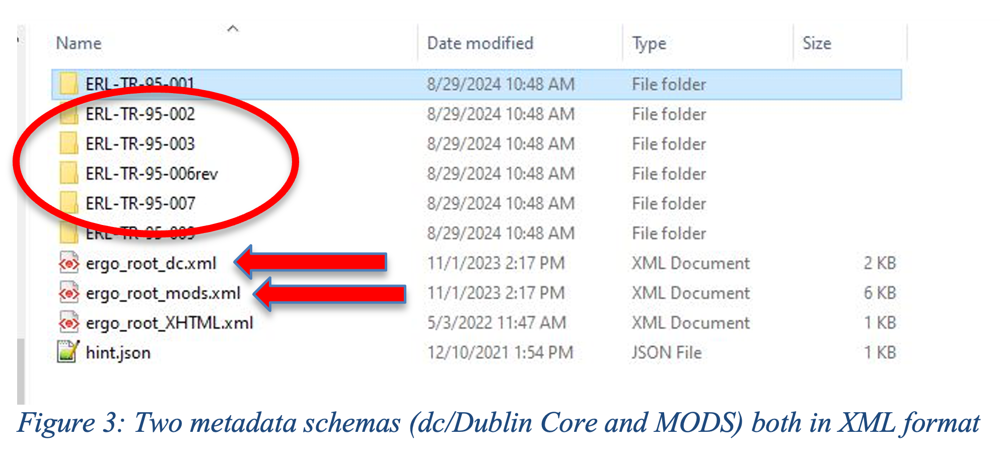
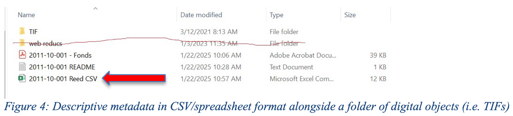

---
layout: page
title: Preparing for Content Ingest
--- 

The goal of digital preservation is to maintain access to and usability of digital collections over a long period of time. In a future recovery situation, it’s important that the digital content you transfer to MDPN’s repository are properly described and organized. This way, the preserved collection will be understandable and useful to current and future members of your organization.

In this section, we will go over the following: 
- File naming best practices
- What Member Acronym are and why the MDPN uses them
- Descriptive metadata recommendations for preservation
- What metadata formats and standards the MDPN accepts

## File Naming and Organization

It is important to impose clear and understandable file organization and naming on collections being preserved for the long-term future. This enables future users from your organization to understand and provide context to your digitally preserved collections if they ever need to be restored. establish appropriate and accurate file naming conventions for content being
digitized. If your organization does not already have file naming guidelines, take some time to decide on a short, simple set of naming practices, then document these and apply them
consistently. 

### File Naming Guidance
1.	Do not use spaces, because they are not recognized by the LOCKSS software. Instead use underscores (file_name), no separation (filename), or camel case (FileName).
2.	Do not use special characters: ~ ! @ # $ % ^ & * ( ) ` ; < > ? , [ ] { } ‘ “. Including any special characters in your file name disrupts DART’s data packaging and will cause issues on the MDPN staging server which might mean your collection can’t be harvested into LOCKSS.
3.	A good format for dates is YYYYMMDD (or YYMMDD). This makes sure all your files stay in chronological order.
4.	Don’t make file names too long; longer names are more difficult to read in a directory system and can invite reading errors. Limit file names to 25 characters or less if possible.
5.	For sequential numbering, use leading zeros to ensure files sort properly. For example, use “0001, 0002…1001, etc” instead of “1, 2…1001, etc.” 
6.	To manage different iterations of a collection in progress, include a version number in the file name, i.e. v1, v2, etc.

### Member Acronyms
MDPN members are assigned an institutional identifier consisting of a 2-4 letter acronym
based on the name of the organization. Acronyms should be included at the beginning of your collection’s file name in order to identify members’ content in the LOCKSS preservation network. Ownership information is also recorded by DART when ingesting a collection into MDPN, so forgetting it does not mean you have to re-ingest the collection. But the acronym does allow the MDPN support team to identify collections more easily, in the case of a disaster recovery or restoration situation, without needing to investigate the metadata inside the collection package itself. 

Acronyms are in the table below:

| Member Organization | Acronym |
| ------------- | ---------- |
| Capital Area District Libraries  |	CADL |
| Comstock Township Library  |	CTL |
| Eastern Michigan University  |	EMU |
| Hillsdale College  |	HDL |
| Kalamazoo College  |	KC |
| Kalamazoo Valley Museum  |	KVM |
| Michigan State University  |	MSU |
| Northern Michigan University  |	NMU |
| Traverse Area District Library  |	TADL |
| University of Michigan  |	UM |
| Wayne State University  |	WSU |
| Western Michigan University  |	WMU |

File Naming Examples
The three elements work together to locate a specific file by its institution, the parent collection, and its context within the original order of the collection materials:
1. Member acronym
2. Collection Name: This should be the title of the collection being ingested.
3. File Descriptive: Any combination of contextual information that could be useful in explaining what the collection is. This could be a collection or accession number, the page number from a volume, a sequence number from a photograph collection series, the date the content was created or digitized, or anything that provides useful identifying information about the collection. **Always document the choices that you make so that future collections stewards at your organizations will understand the naming pattern.**

Model format for MDPN files:
Acronym_CollectionName_XXX_ABC

Examples of file names:
- SCPL_CivilWar_032_04
- KCPL_CivilCourt_0011a
- ALA_Peterson_2011_02
- RHIT_Peddle_0034c

## Metadata
[Metadata](https://dictionary.archivists.org/entry/metadata.html) is information that describes or provides context to other data. In other words, metadata tells us the who, what, when, where, and why of a digital object. The MDPN is interested in recording and preserving both descriptive and technical/structural metadata about your digital collection. Both are vital for current and future members of your organization to understand the digital collections you preserve.

### Descriptive Metadata
[Descriptive metadata](https://dictionary.archivists.org/entry/descriptive-metadata.html) provides information such as creator, date, location, etc. about the items in your digital collection or about the collection as a whole. The MDPN encourages, but does not require organizations have item-level metadata to preserve as part of their digital collections. We understand that creating item-level metadata can be a time-consuming process, especially for small organizations or those that rely on volunteers. However, more information about the items in your collection promotes better usability and understandability to future users, which is the ultimate goal of digital preservation. You can also add descriptive metadata to your collection at a later date after it’s been preserved. For more on this process and how to document it in your file names, see “Versioning” in this technical guidance. 

**MDPN is metadata standard and format agnostic.** This means that the MDPN does not require you to follow a specific metadata standard, nor do we require you save your metadata in a particular file format. Below are some examples of descriptive metadata files and how they appear alongside the digital objects in your preservation package.

Please note that MDPN **does not** generally assist with metadata creation or remediation, but we can point you to resources to help with this work. Reach out to the MDPN Coordinator for more information. 

<b> "Not Required" Does Not Mean "Not Important" </b>

You will notice that certain information, like collection- and item-level metadata, are not required for transfer to MDPN. It is important to keep in mind that in the context of DART, **not required does not mean not important.** 

For DART, not required simply means that the component will not impact the validity of your bag or DART seeing your bag as valid. However, digital preservation is concerned about future use and access of digital materials over time. A lack of descriptive metadata will not prevent DART from bagging your content, but it will impact how future users and stewards might understand your collections in the future. 

### Technical Metadata

Technical metadata is information about your collection’s structure, including size, when and how it was packaged and by whom, and relevant fixity information. This metadata will be created by you using DART. See the “Bag Metadata” heading under [Transferring Content with DART](https://midpn.github.io/public-documentation/transferring-content-with-dart.html) in this doucmentation site for more details. 

