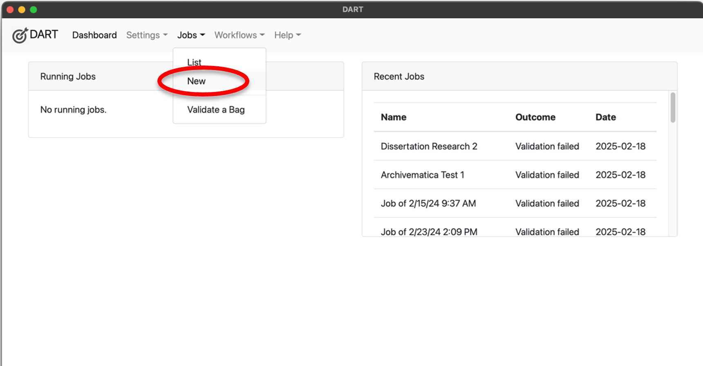
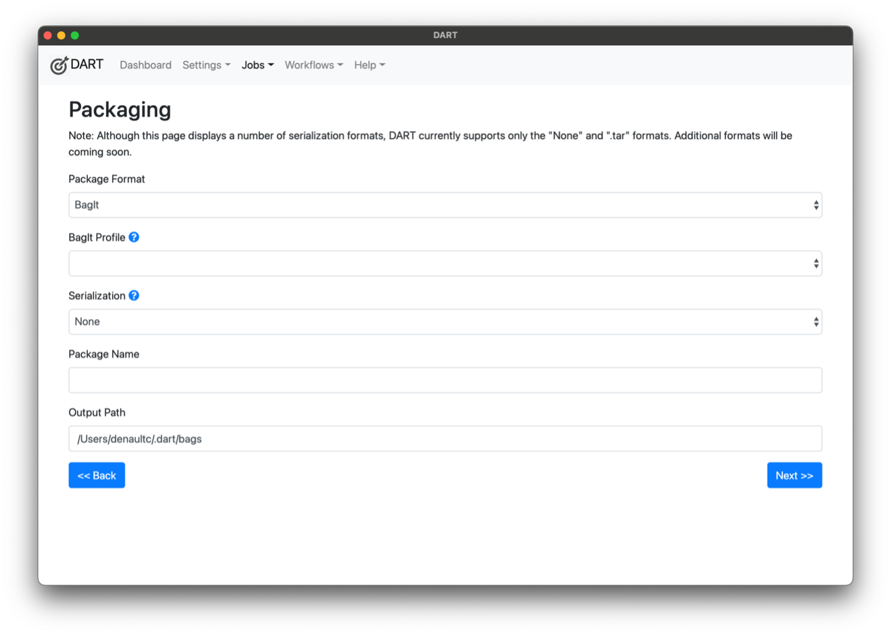
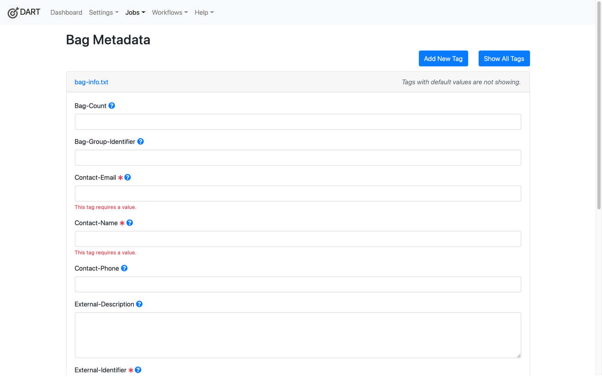
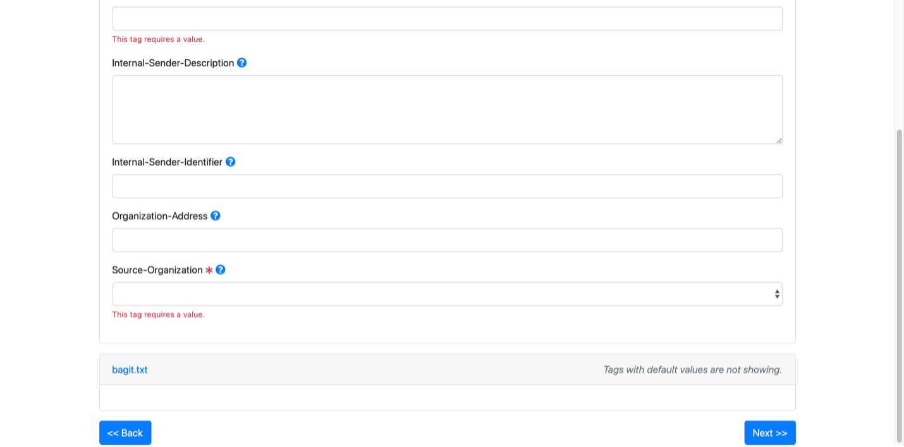

## Transferring Content with DART

In this section, we will go over the following: 
- What a “Bag” is and why MDPN uses it
- The structure of a bag, its mandatory components, and what you provide to MDPN to package.
- How to run a new job in DART and create a new repeatable workflow
- How to define necessary structure and metadata for your bag

### What’s a Bag and Why Do We Need It?

According to the BagIt standard created by the Library of Congress, a bag is a “a set of hierarchical file layout conventions for storage and transfer of arbitrary digital content” (Kunze et al., 2018, para. 1). Put more simply, a bag can be understood as a package for various folders of digital content. It is a standardized way of organizing the contents of your collection for preservation, so that all the component elements of a digital collection are stored and preserved alongside each other.

The BagIt standard enables interoperability. In most cases, interoperability ensures that someone outside of a collection’s originating organization will have all the information necessary to understand and use a collection. In our case, interoperability is ensuring that future members of your organization can understand and use your preserved collections. For more details on the BagIt Standard you can visit https://datatracker.ietf.org/doc/html/rfc8493. For more on the creation of the BagIt Standard by the Library of Congress, enjoy this 10th anniversary blog post by Liz Madden, Digital Media Project Coordinator in the Office of the Chief Information Officer’s Platform Services Division.

### What’s in a Bag?

A valid bag, according to the specification, requires 3 components: a “Bag Declaration,” a “Payload Directory,” and a “Payload Manifest.” A bag can have more information than these three items. This is the case when using DART to create a bag. Bags created using DART do include these 3 required components, but also generate additional useful contextual information about your collection. 

Table 5 lists the components that are in a bag packaged using DART. Some of these files will be created for you when packaging your content with DART. MDPN members are only responsible for providing digital content as part of the Data Folder and entering information in designated fields in DART as part of the Bag Metadata. The bolded items under the “Bag Component” column are the three required elements of a valid bag according to the BagIt Standard.

| Bag Component | Bag Folder | Created by DART? | Description |
| ------------- | ---------- | ---------- | ----------
| Payload Directory   | collection/data |NO|This is a folder filled with the digital objects you plan to preserve, as well as any descriptive metadata, ReadMe file, and other information describing the collection. |
| Payload Manifest | /manifest-sha256.txt |YES| This contains the checksum for each item in your collection, along with the item’s file path.
| Bag-Level Checksum Information | collection/tagmanifest-sha256.txt | YES|A tag manifest creates a checksum for these files that are stored in DART.
| Bag Metadata | /bag-info.txt |SORT OF| This contains technical and administrative metadata about the digital collection you are transferring to MDPN. This information is entered by you in DART. DART then formats that information into a text file.
| Bag Declaration | /bagit.txt |YES|This records which version of the BagIt standard and character set encoding used to bag your items, so that future software can “unpack” the content correctly.

<b> Your Curatorial Choices </b>

MDPN uses DART to generate many of the bag components as shown in Table 5 for you.
  
Items in the /data folder come from your organization and the subsequent structure is up to your organization and any internal standards you may have. Once uploaded to DART, this structure remains and is the structure that your objects will keep in the MDPN LOCKSS repository. This structure is merely a suggestion, but we strongly recommend that you keep a similar structure. This structure allows you to keep track of necessary information to include and allows you to more easily find the information you need.

For a more comprehensive resource on DART, visit the Digital Archivist’s Resource Tool (DART) specification page located under the "Additional Resources" section.

### Running a Job with DART
To begin transferring a new digital collection to the MDPN, start by opening the DART application on your workstation. This should start by bringing you to the home screen, where you can select “Jobs” and then “New.”

#### A note on size:
Neither DART nor LOCKSS have any prescribed size restrictions. However, members should take some considerations in mind when bagging their collections. 
1.	**Network interruptions**: your network bandwidth may be relatively small or your network might experience unplanned outages during file transfer, which could cause your upload from DART to fail. By trying to ingest a larger bag, which takes more time, you may open yourself up more to a potential time-out failure. 
2.	**Staging server limitations**: the staging server has slightly more than 1TB available for depositing collections. However, the availability of this total space is impacted by use across the network and how often node hosts crawl new collections. The space on the staging server can grow if there is a demonstrated need, so contact the MDPN Coordinator to discuss this.
3.	**Polling frequency**: large AUs take more time for LOCKSS to complete a fixity poll on the content they contain, which might mean your large AU could get polled less often than other smaller AUs. 

As such, MDPN suggests limiting bags to around **100GB** in size, though bags around **50GB are preferred**. Multiple bags of content split from the same collection can be associated with each other in the “Bag Metadata” section of DART. If you have a strong case for bagging a collection that’s over 100GB, please reach out to the MDPN Coordinator to make the necessary accommodations. 

### Packaging
This section is where you’ll define structural parameters for your bag.

**Package Format**: select “BagIt”

**BagIt Profile**: select “MDPN”

**Serialization**: select “.tar”

**Package Name**: Create a name for your Bag (please refer to the file naming guidelines suggested earlier and do not forget to start with your Member Organization Acronym!)

**Output Path**: this is generated automatically by DART based on your Package Name, but it can be edited 

After completing all fields, select **Next >>** in the blue box at the bottom right of your screen.

### Bag Metadata
This section is where you provide helpful technical and administrative metadata about your digital objects. There are four required fields, indicated below, but the MDPN encourages members to be as thorough as possible in completing these prompts. 

**Bag-Count**: Two numbers separated by "of", in particular, "N of T", where T is the total number of bags in a group of bags and N is the ordinal number within the group.  If T is not known, specify it as "?" (question mark): for example, 1 of 2, 4 of 4, 3 of ?, 8 9of 145. This metadata element SHOULD NOT be repeated.  If this metadata element is present, it is RECOMMENDED to also include the Bag-Group-Identifier element.

**Bag-Group-Identifier**: A sender-supplied identifier for the set, if any, of bags to which it logically belongs, such as a collection name or accession number.

**Contact-Email [Required]**: Fully qualified email address of person or position responsible.

**Contact-Name [Required]**: Person at the source organization who is responsible for the content transfer.

**Contact-Phone**: International format telephone number of person or position responsible.

**External-Description**: A thorough description of the bag’s contents and/or provenance for those outside of your organization. When describing your Bag, think about what information might provide useful context for a future user to understand what the package contains. Common info includes: file types, content types (oral histories, journals, photos, etc), inclusive dates, 

**External-Identifier [Required]**: A sender-supplied identifier for the bag, such as a control number, unique identifier, or collection filename. This is often, but isn't required to be, the same as your "Package Name" on the previous screen, though we do ask you begin with your Member Organization Acronym. Used as the AU Title in LOCKSS and is important for recovery and identification purposes. **This value cannot be duplicated in any other Bag.**

**Internal-Sender-Description**: A sender-local explanation of the contents and provenance

**Internal-Sender-Identifier**: An alternate sender-specific identifier for the content and/or bag, such as an accession number for the collection.

**Organization-Address**: Mailing address of the source organization.

**Source-Organization [Required]**: select your organization from the list. Please note that your staging server credentials will only work if you select your organization.
    
    
An example of what information can potentially go into these fields is as follows:

???? HELP

After completing all fields, select **Next >>** in the blue box at the bottom right of your screen.

### Upload Targets
This section is where you’ll identify where you’d like to upload your content to.

Select “MDPN Staging”

After completing all fields, select “Next >>” in the blue box at the bottom right of your screen.

### Review and Run
Take a moment to review the data listed. Make sure it is being uploaded to the correct location (MDPN Staging) using the correct Bagging Profile (MDPN) and your Package Name begins with your Organization’s Acronym. After reviewing the data, select “Run Job” in the green box on the bottom right of your screen.

### Additional Documentation: 
DART: https://aptrust.github.io/dart-docs/ 
LOCKSS 2.0: https://docs.lockss.org/projects/manual/en/latest/ 
